### Video Summary
<p align="center">
<div id="video_frame">
  <iframe width="560" height="315" src="https://www.youtube.com/embed/F1k1Qw6ZEIo" frameborder="0" allowfullscreen></iframe>
</div>
</p>


## 1.Project Summary
Solve an intricate maze with traps, lava, etc. Optimize by trying to improve the time the agent solves the maze or by finding the most optimal path. The input of the project would require a section of the map the agent would traverse. Output would be the most optimal path discovered by the agent. Lastly, we assume that every block is unknown and the agent must discover each path. Direct applications of this project would allow users to optimally beat multiple video games. At a high level, reinforcement learning discovered from this project can determine the ideal behavior within the manufacturing, delivery, and finance industries.

Different from what we proposed before, we added a new Level 0 to discover the relation between reward values and agent’s action. <br>
Moreover, We also discard our level 5 since we found it was not necessary to add a zombie. The zombie does not affact what we want to study in this project. Instead, we made a larger and more complex map for level 4.<br>
Now, agent can either Move 1 steps or Jump 2 steps.<br>
<br>
Here is a brief description of our test environment:<br>

__Level 0__: Flat terrain, with edge boundary and hazards, agent must Jump to find the most optimal path (Actions: Walk, Jump) <br>
__Level 1__: Flat terrain, with edge boundary  (Actions: Walk, Jump)<br>
__Level 2__: Flat terrain, with edge boundary and hazards in the middle of the map  (Actions: Walk, Jump)<br>
__Level 3__: 3D terrain, hills, hazards, blocks  (Actions: Walk, Jump)<br>
__Level 4__: 3D terrain, hills, hazards, blocks, a larger and more complex map  (Actions: Walk, Jump)<br>

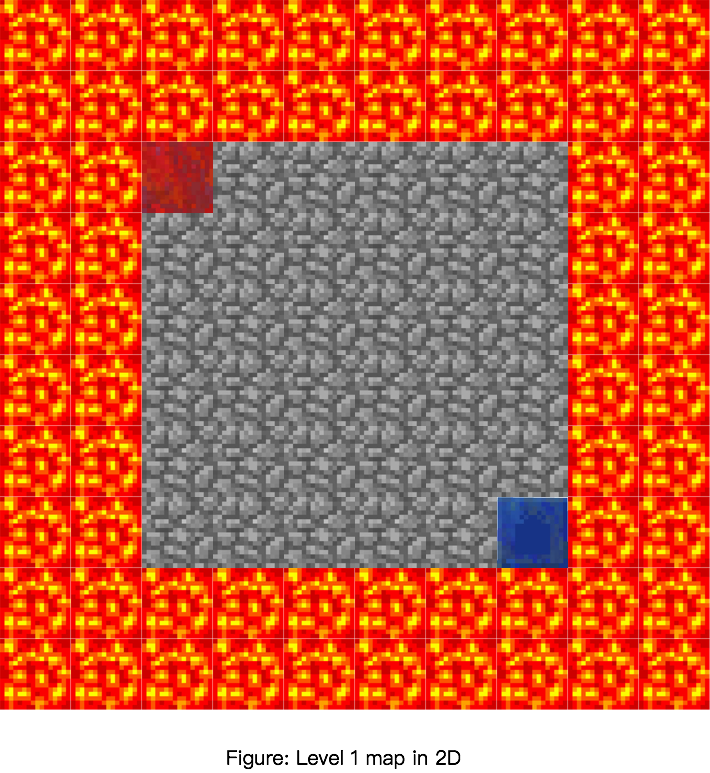 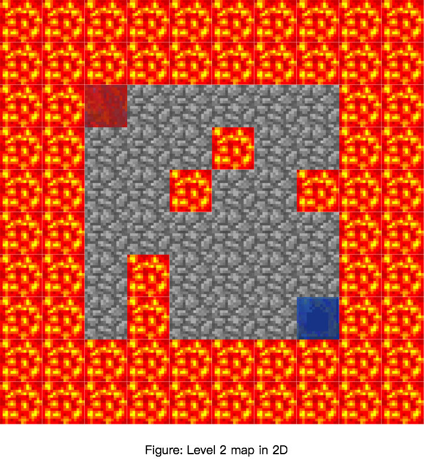 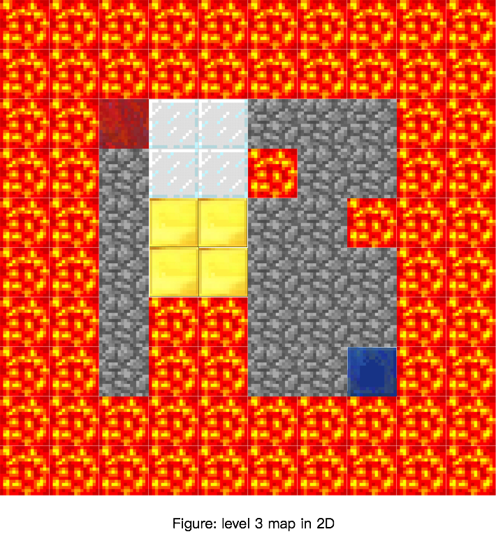 <br>
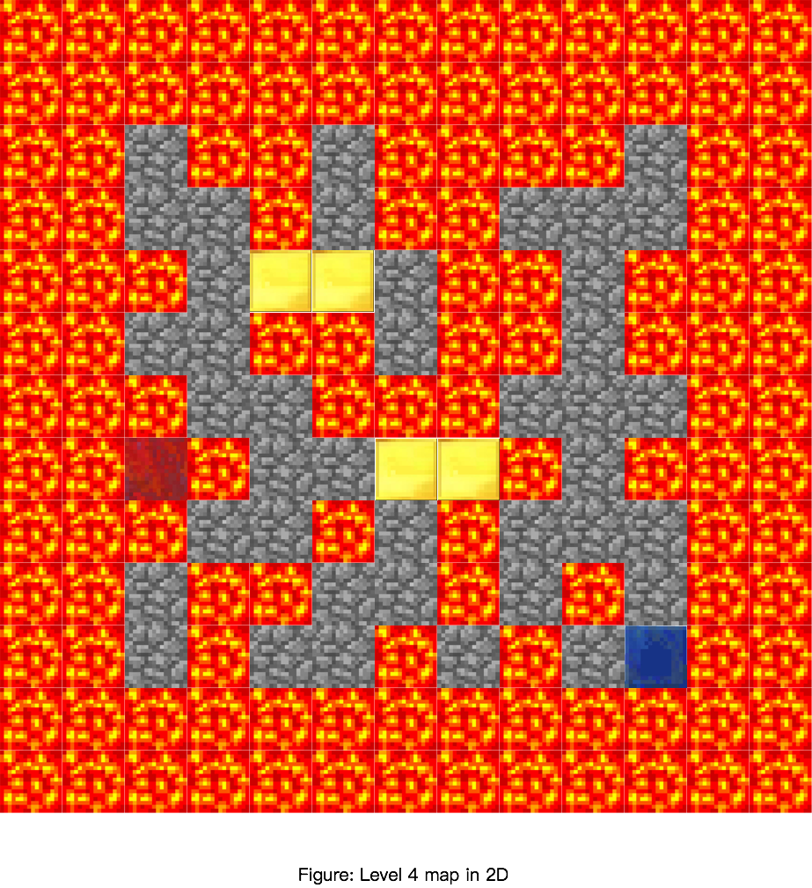


## 2.Approaches

For final report, our approach used the Q-Learning algorithm. Here is the equation of Q-Learning algorithm and our parameter set-up.<br>
The Q-Learning equation:<br>

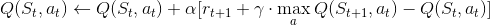

```python
self.epsilon = 0.01 # chance of taking a random action instead of the best
self.alpha = 0.1 # learning rate
self.gamma = 1.0 # discount rate

# Set of actions
self.actions = ["movewest 1", "moveeast 1", "movenorth 1", "movesouth 1", "tpn", "tps", "tpe", "tpw"]
# Additional action costs to take into account (Each action costs 1 by default). 
# Action cost = 1 + self.action_cost[i]
```
```python
#agent 1
self.action_cost = [0, 0, 0, 0, 9, 9, 9, 9]
```
```python
#agent 2
self.action_cost = [0, 0, 0, 0, 300, 300, 300, 300]
```
```python
#Initial Q Values (this snippet is used everytime agent discovers a new area in the map)
if not self.q_table.has_key(current_s):
  self.q_table[current_s] = [0, 0, 0, 0, -2, -2, -2, -2]
 ```
  
**Learning Rate:** <br>
Alpha represents the learning rate. It is value between 0 and 1 ( 0 \< a \< 1). It indicates how much the utility values will be updated every time the agent takes an action. alpha = 0 means the agent will not learn anything. alpha = 1 means the agent will not consider any feature states (the agent only consider most recent information). In stochastic environment, alpha is preferable closer to 0 than 1. In our approach, we decide alpha value to be 0.1<br><br>
**Discount Factor:** <br>
Gamma is the discount factor. It determines the importance of future information.  Gamma closer to 0 will encourages the agent to seek out rewards sooner rather than later. It makes the agent assign a smaller reward to the feature action. Gamma closer to 1 will makes the agent seek for high reward in the feature. This value usually closer to 1. We set gamma value to 1 in our approach<br><br>
**Random Action:** Epsilon is the possibility of taking a random action instead of the best one.<br><br>
**Immediate Reward Value:** r is the immediate reward value. <br><br>
**Max Q Value:** The action has the highest utility value in next state will become the new Q value of that states. <br>

**Initial Q Values** <br>
We decided to give each state 8 initial Q Values where the first 4 values are 0 and the last 4 are -2. These values were set to make the agent prefer walking over jumping initially until walking's Q value drops to -2. This was only used for levels 1, 2, 3.

**Note:** Notice how each action costs 1 by default. We decided to creat an action\_cost array to add additional cost to specific actions. A 'jump' has an additional cost of 9 on top of the default cost of 1 whereas a 'move' has no added cost.

### Test Environment
Currently, we have four maps, level 0 is based on level 1, level 2 is is based on level 1, level 3 is based on level 3, level 4 based on level 3
The figures show the grid layouts in two-dimensional. The figures specify the start and end blocks. Also，the figures show the terrian of mazes(the floor of the maze is cobblestone, block is built by glass\_blocks, hill is built by cobblestone\_blocks). The number in each grids represent the **(x,z)** value and each grids has an altitude value which is  **y**.
###  Level 0:
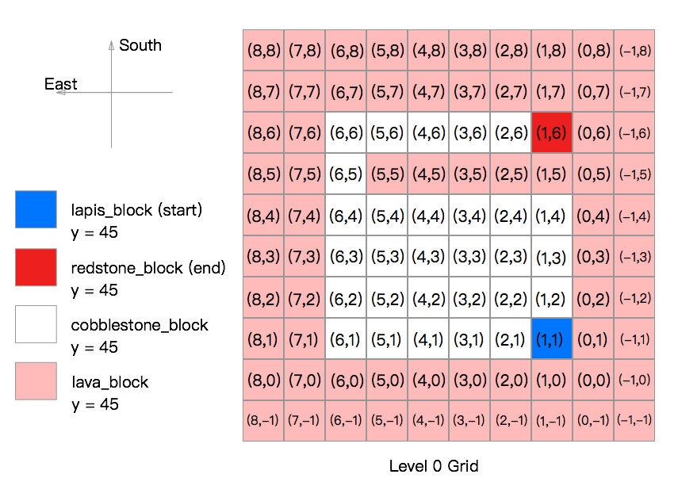 <br>
The level 0 map is a flat terrain with lava on eages. There is a lava river blocks agent way to reach the goal state. It is a 8x8x1(LxWxH) grid. This level was used to show how changing the cost of jumping forces the agent to choose one path over the other. The first optimal path to the goal involves jumping over the lava to reach the goal block, whereas the second optimal path only includes walking.
__Reward for each actions for Agent 1:__
For each action the agent makes, there is a reward value of -1 for each move, -10 for each jump, -100 for reaching the lava block, +300 for reaching the redstone\_block(goal state).
__Reward for each actions for Agent 2:__
For each action the agent makes, there is a reward value of -1 for each move, -301 for each jump, -100 for reaching the lava block, +300 for reaching the redstone\_block(goal state)<br>

Currently, we have three maps, each one is based on the previous one.
###  Level 1:
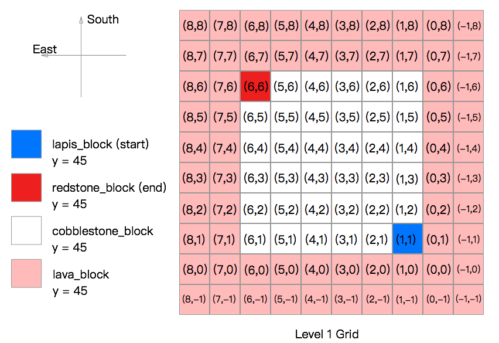 <br>
The level 1 map is a flat terrain with lava on eages. It is a 8x8x1(LxWxH) grid. The agent start at the lapis\_block and try to reach the redstone\_block. The agent can either walk or jump. In level 1, there are 64 states and 2 actions
__Reward for each actions:__
For each action the agent makes, there is a reward value of -1 for each move, -10 for each jump, -100 for reaching the lava block, +100 for reaching the redstone\_block(goal state)<br>
###  Level 2:
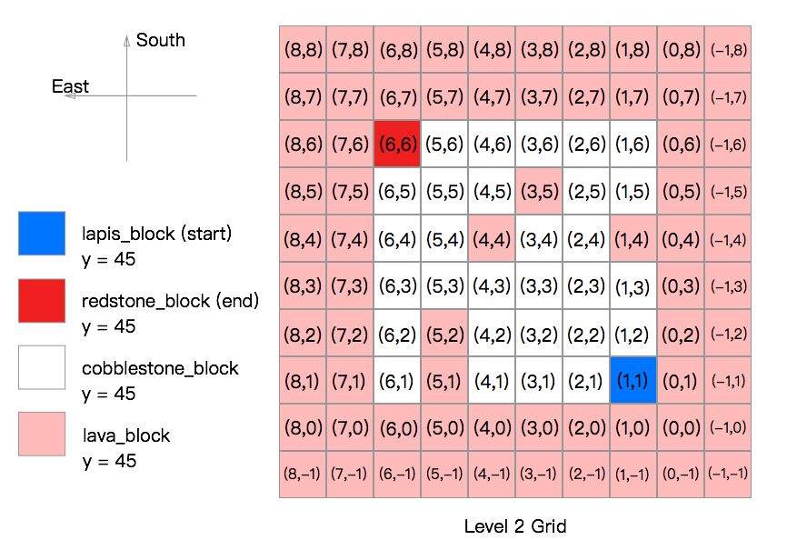 <br>
The level 1 map is built based on Level 1 map. 5 cobble stone blocks in the middle of map were replaced by 5 lava blocks.It is a 8x8x1(LxWxH) grid. The agent start at the lapis\_block and try to reach the redstone\_block. The agent can either walk or jump. In level 2, there are 64 states and 2 actions
__Reward for each actions:__
For each action the agent makes, there is a reward value of -1 for each move, -10 for each jump, -100 for reaching the lava block, +100 for reaching the redstone\_block(goal state)<br>
### Level 3:
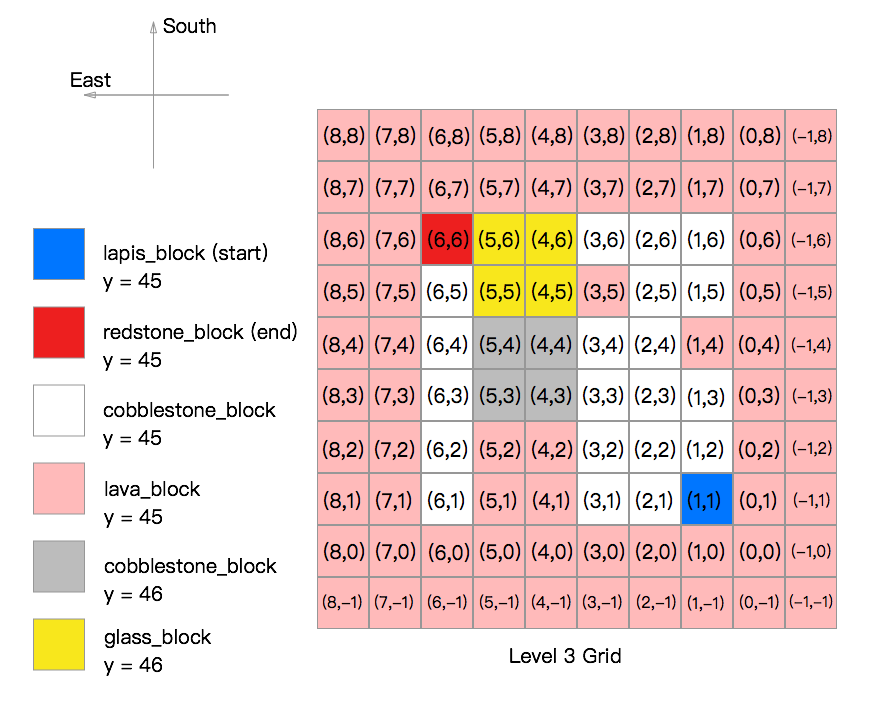 <br>
Level 3 map was built based on level 2 map. A 2x2x2(LxWxH) glass block and a 2x2x1(LxWxH) cobble stone hill. Agent can jump over the cobble stone block(gold) but cannot jump over the glass block. The agent start at the lapis\_block and try to reach the redstone\_block. The agent can either walk or jump. In level 3, there are 64 states and 2 actions
__Reward for each actions:__
For each action the agent makes, there is a reward value of -1 for each move, -10 for each jump, -100 for reaching the lava block, +100 for reaching the redstone\_block(goal state)<br>

### Level 4:
 <br>
The Level 4 map has the same concept as level 3 map but larger and more complex. It is a 11x11x3(LxWxH) grid. The first optimal path to the goal involves jumping over the lava to reach the goal block. In level 3, there are 121 states and 2 actions<br>

__Reward for each actions:__
For each action the agent makes, there is a reward value of -1 for each move, -10 for each jump, -100 for reaching the lava block, +100 for reaching the redstone\_block(goal state)


## 3.Evaluation
For **qualitative evaluation**, we evaluate our project by checking how well the agent can solve all 3 level mazes. We observe the agent when it is solving the maze to verify it works correctly. Also, we can check our agent by using the Cumulative Rewards Table.

For **quantitative evaluation**, we plotted the reward values in a graph to see whether or not the reward found by the agent eventually converges near the optimal solution. We plotted the optimal solution as a dashed red line and the rewards found by the agent as a blue solid line.<br>

**Level1:** one of the optimal path of level 1 is *(1,1) move-\> (1,2) move-\> (1,3) move-\> (1,4) move-\> (1,5) move-\> (1,6) move-\> (2,6) move-\> (3,6) move-\> (4,6) move-\> (5,6) move-\> (6,6)*. It takes 10 moves. Therefore, the best reward we can get is 90. The evaluation graph shows how the agent successfully finds the solution with the highest reward. Notice how towards the end the value converges to 90.

<center>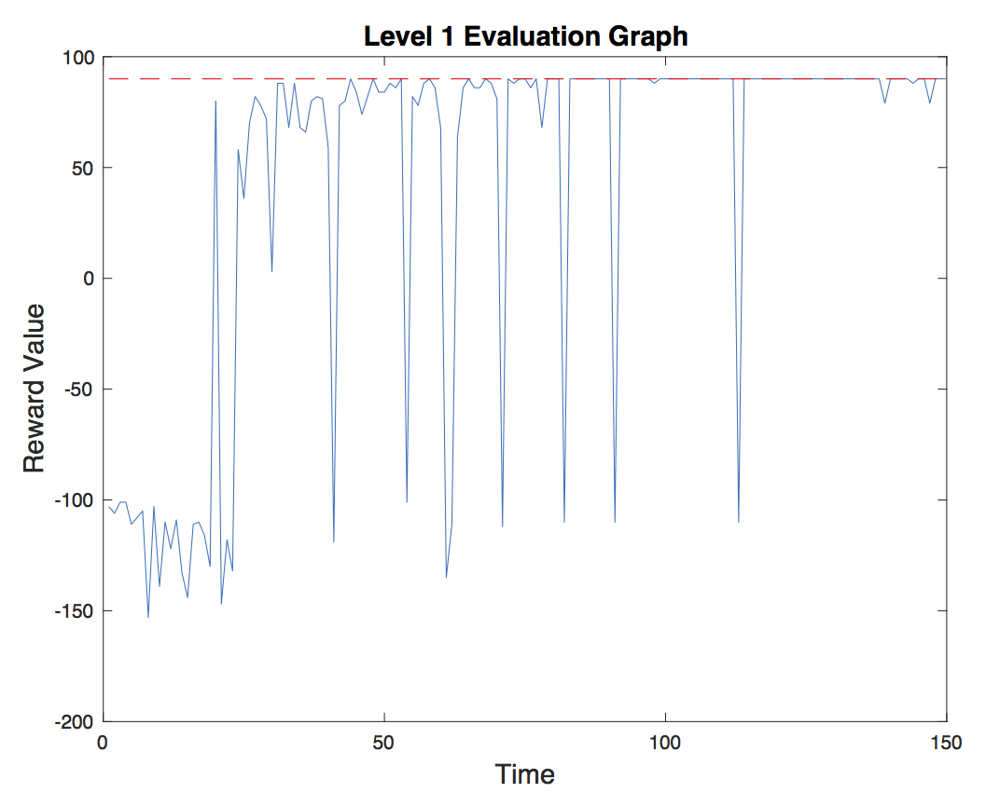</center><br>

**Level2:** one of the optimal path of level 2 is *(1,1) move-\> (2,1) move-\> (2,2) move-\> (2,3) move-\> (3,3) move-\> (4,3) move-\> (5,3) move-\> (5,4) move-\> (5,5) move-\> (5,6) move-\> (6,6)*. It also takes 10 moves. Therefore, the best reward we can get is 90. Here is the Cumulative Rewards Table of level 2. The agent successfully finds the solution with the highest reward in level 2.

<center>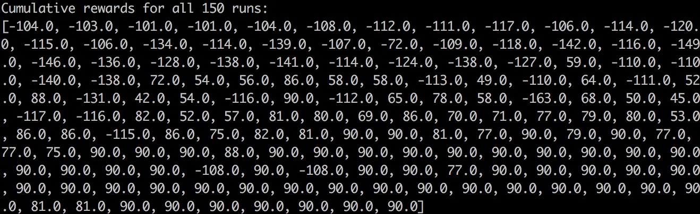</center><br>

**Level3:** one of the optimal path of level 3 is *(1,1) move-\> (2,1) move-\> (2,2) move-\> (2,3) move-\> (3,3) moves-\> (3,4) jump-\> (4,4) move-\> (5,4) move-\> (6,4) move-\> (6,5) move-\> (6,6)*. It takes 10 moves. However, from (3,4) to (4,4) the agent takes the action "JUMP" witch takes 10 rewards. Therefore, the best reward is 100 - 10 - 9 = 81. Here is the Cumulative Rewards Table of level 3. The agent successfully finds the solution with the highest reward in level 3.

<center>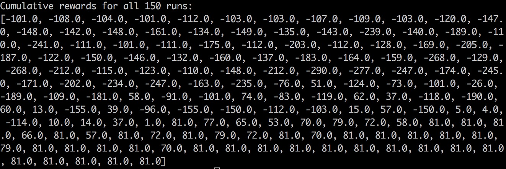</center><br>

<br>
In addition to plotting graphs, we decided to use a second method for **quantitative evaluation**. We evaluate our project by checking how long it takes the agent to solve each mazes. That is, we want the agent to slove the maze as quick as it can. We use the Cumulative Rewards Table to check how many runs it takes before getting the best reward. In the most recent test, the agent needs 44 runs in level 1, 56 runs in level 2 and 104 runs in level 3. We hope we can improve this by changing our reward function and Q-Learning parameter. We want to see how changes on these parameter can affect agent's performance.<br>

```
| Tables        |    level 1    |    level 2     |    level 3    |
| ------------- |:-------------:| :-------------:|:-------------:|
| # of runs     |      44       |       56       |      104      |
```


# 4.Remaining Goals and Challenges
For the rest of weeks, we will add a “timed jump” which means the agent can either jump 1 blocks or 2-3 blocks. This will occur in level 4. It will be interesting to discover how the agent will perform when we add more uncertainty into the map and how we can improve its performance by adjusting our parameter values(reward values, learning rate, discount rate, etc.). Moreover, we plan to add nondeterministic actions into our project. For example, the agent may have a 20% probability of jumping left as opposed to walking left, obviously with respective reward factors for each action.
Also, by level 5, our moonshot case, we will add zombies that will patrol the map and force the agent to perform zombie avoidance. This will add more actions to our project. Some challenges we faced while solving our three levels was being able to find an optimal path within 150 trials. This took many attempts at adjusting our Q-learning algorithm and by assigning a very large reward factor towards jumping. We did this because our agent would continually try to jump on the level 1 map, which did not require jumping to be solved optimally. Given our experience so far, so challenges we will face in the future are implementing more actions into our project and performing zombie avoidance. We plan to adjust our reward values accordingly and improve upon our Q-Learning algorithm to solve an optimal path with minimal trials. If the project proceeds as planned our team should be able to solve a level 5 map on a moderate to large scale.<br>
