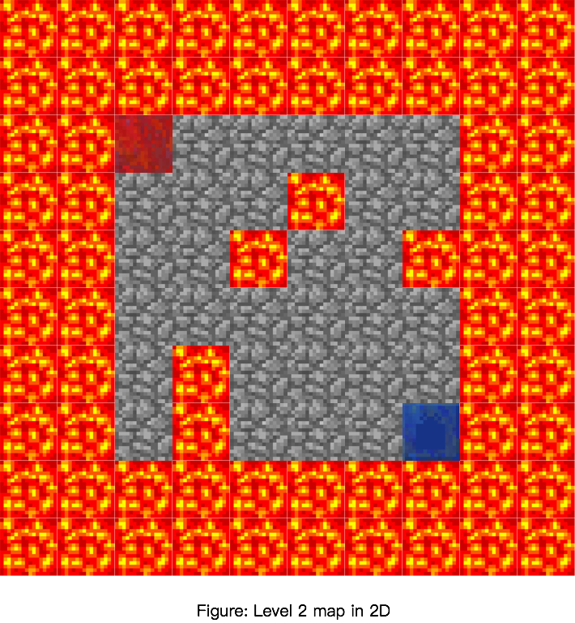
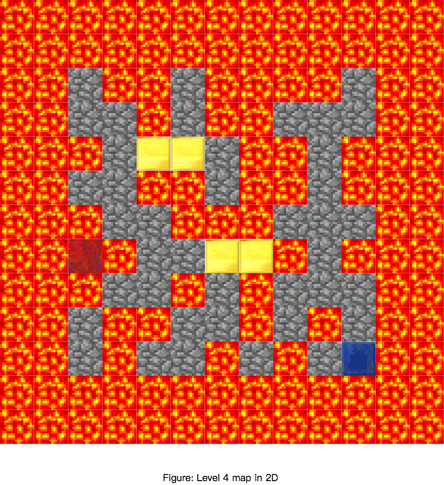

### Project Summary
Solve an intricate maze with traps, lava, etc. Optimize by trying to improve the time the agent solves the maze or by finding the most optimal path. The input of the project would require a section of the map the agent would traverse. Output would be the most optimal path discovered by the agent. Lastly, we assume that every block is unknown and the agent must discover each path. Direct applications of this project would allow users to optimally beat multiple video games. At a high level, reinforcement learning discovered from this project can determine the ideal behavior within the manufacturing, delivery, and finance industries.

Different from what we proposed before, we added a new Level 0 to discover the relation between reward values and agent’s action.  
Moreover, We also discard our level 5 since we found it was not necessary to add a zombie. The zombie does not affact what we want to study in this project. Instead, we made a larger and more complex map for level 4. 
Now, agent can either Move 1 steps or Jump 2 steps. 
 
Here is a brief description of our test environment: 

__Level 0__: Flat terrain, with edge boundary and hazards, two agents, agent1 must Jump to find the most optimal path (Actions: Walk, Jump)  
__Level 1__: Flat terrain, with edge boundary  (Actions: Walk, Jump) 
__Level 2__: Flat terrain, with edge boundary and hazards in the middle of the map  (Actions: Walk, Jump) 
__Level 3__: 3D terrain, hills, hazards, blocks  (Actions: Walk, Jump) 
__Level 4__: 3D terrain, hills, hazards, blocks, a larger and more complex map  (Actions: Walk, Jump) 

   

### Video Summary

  <iframe width="560" height="315" src="https://www.youtube.com/embed/F1k1Qw6ZEIo" frameborder="0" allowfullscreen></iframe>

