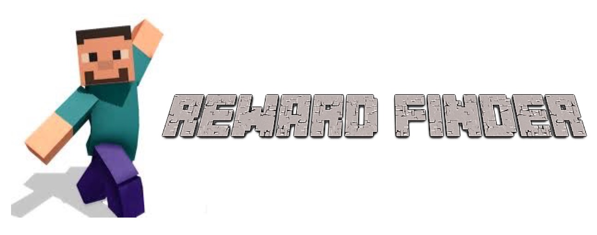
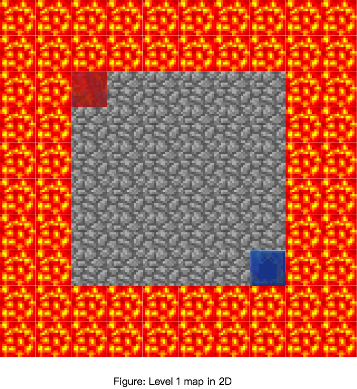

### Project Summary
&nbsp;&nbsp;&nbsp;&nbsp; Solve an intricate maze with traps, lava, etc. Optimize by trying to improve the time the agent solves the maze or by finding the most optimal path. The input of the project would require a section of the map the agent would traverse. Output would be the most optimal path discovered by the agent. Lastly, we assume that every block is unknown and the agent must discover each path. Direct applications of this project would allow users to optimally beat multiple video games. At a high level, reinforcement learning discovered from this project can determine the ideal behavior within the manufacturing, delivery, and finance industries.

Level 0: Flat terrain, with edge boundary and hazards, agent must Teleport to find the most optimal path (Actions: Walk, Teleport)  
Level 1: Flat terrain, with edge boundary (Actions: Walk, Teleport)  
Level 2: Flat terrain, with edge boundary and hazards in the middle of the map (Actions: Walk, Teleport)  
Level 3: 3D terrain, hills, hazards, blocks (Actions: Walk, Teleport)  
Level 4: 3D terrain, hills, hazards, blocks, a larger and more complex map (Actions: Walk, Teleport)    

   

### Video Summary

  <iframe width="560" height="315" src="https://www.youtube.com/embed/F1k1Qw6ZEIo" frameborder="0" allowfullscreen></iframe>

