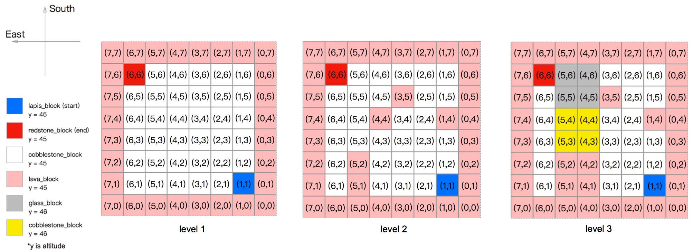

# Project Summary
&nbsp;&nbsp;&nbsp;&nbsp; Solve an intricate maze with traps, lava, etc. Optimize by trying to improve the time the agent solves the maze or by finding the most optimal path. The input of the project would require a section of the map the agent would traverse. Output would be the most optimal path discovered by the agent. Lastly, we assume that every block is unknown and the agent must discover each path. Direct applications of this project would allow users to optimally beat multiple video games. At a high level, reinforcement learning discovered from this project can determine the ideal behavior within the manufacturing, delivery, and finance industries.

Level 1: Flat terrain, with edge boundary  (Action: Walk, Jump)<br>
Level 2: Flat terrain, with edge boundary and hazards in the middle of the map  (Action: Walk, Jump)<br>
Level 3: 3D terrain, hills, hazards, blocks  (Action: Walk, Jump)<br>
Level 4: 3D terrain, hills, hazards, blocks  (Action: Walk, Jump, Timed Jump)<br>
Level 5: Moonshot case- 3D terrain, hills, hazards, blocks and zombies  (Action: Walk, Jump, Timed Jump)<br>

  


# Approach

For progress report, our approach used the Q-Learning algorithm. Here is the equation of Q-Learning algorithm and our parameter set-up.<br>
The Q-Learning equation:<br>
 ![][1]
```python
self.epsilon = 0.01 # chance of taking a random action instead of the best
self.alpha = 0.1 # learning rate
self.gamma = 1.0 # discount rate
        
# Set of actions
self.actions = ["movewest 1", "moveeast 1", "movenorth 1", "movesouth 1", "jumpnorth 1", \
                        "jumpsouth 1", "jumpwest 1", "jumpeast 1"]
Action cost = 1 + self.action_cost[i]
self.action_cost = [0, 0, 0, 0, 9, 9, 9, 9]
```
**Learning Rate:** Alpha represents the learning rate. It is value between 0 and 1 ( 0 < a < 1). It indicates how much the utility values will be updated every time the agent takes an action. alpha = 0 means the agent will not learn anything. alpha = 1 means the agent will not consider any feature states (the agent only consider most recent information). In stochastic environment, alpha is preferable closer to 0 than 1. In our approach, we decide alpha value to be 0.1<br><br>
**Discount Factor:** Gamma is the discount factor. It determines the importance of future information.  Gamma closer to 0 will encourages the agent to seek out rewards sooner rather than later. It makes the agent assign a smaller reward to the feature action. Gamma closer to 1 will makes the agent seek for high reward in the feature. This value usually closer to 1. We set gamma value to 1 in our approach<br><br>
**Random Action:** Epsilon is the possibility of taking a random action instead of the best one. (needs more here)<br>
**Immediate Reward Valuer:** r is the immediate reward value (needs more/ do we need it?)<br>
**Max Q Value:** The action has the highest utility value in next state will become the new Q value of that states<br>

## The 3 Levels


#### Level 1:
The level 1 map is a flat terrain with lava on eages. It is a 7x7x1(LxWxH) grid. The agent start at the lapis_block and try to reach the redstone_block. The agent can either walk or jump.
#### Level 2:
The level 1 map is built basing on Level 1 map. 5 cobble stone blocks in the middle of map were replaced by 5 lava blocks.It is a 7x7x1(LxWxH) grid. The agent start at the lapis_block and try to reach the redstone_block. The agent can either walk or jump.
#### Level 3:
Level 3 map was built basing on level 2 map. A  2x2x2(LxWxH) glass block and a 2x2x1(LxWxH) cobble stone hill. Agent can jump over the cobble stone block(gold) but cannot jump over the glass block. The agent start at the lapis_block and try to reach the redstone_block. The agent can either walk or jump. 

For each action the agent makes, there is a reward value of -1 for each move, -10 for each jump, -100 for reaching the lava block, +100 for reaching the redstone_block(goal state)


# Evaluation


# Remaining Goals and Challenges

[1]:	https://github.com/Moe202/Reward-Finder/blob/master/docs/images/eq.gif