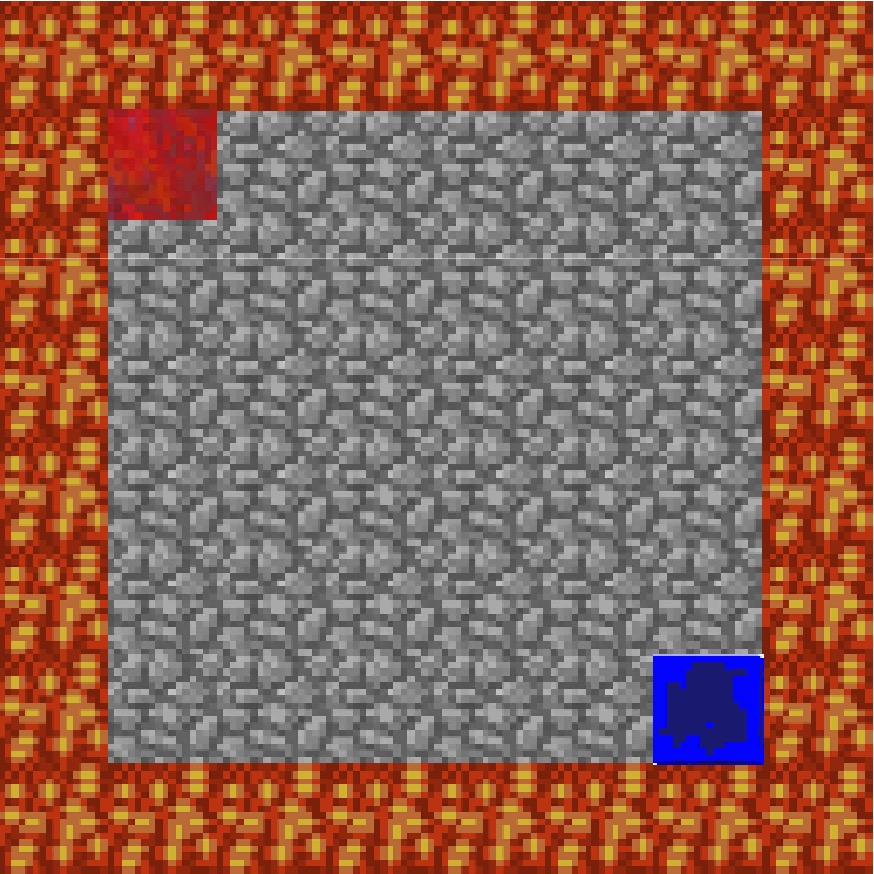
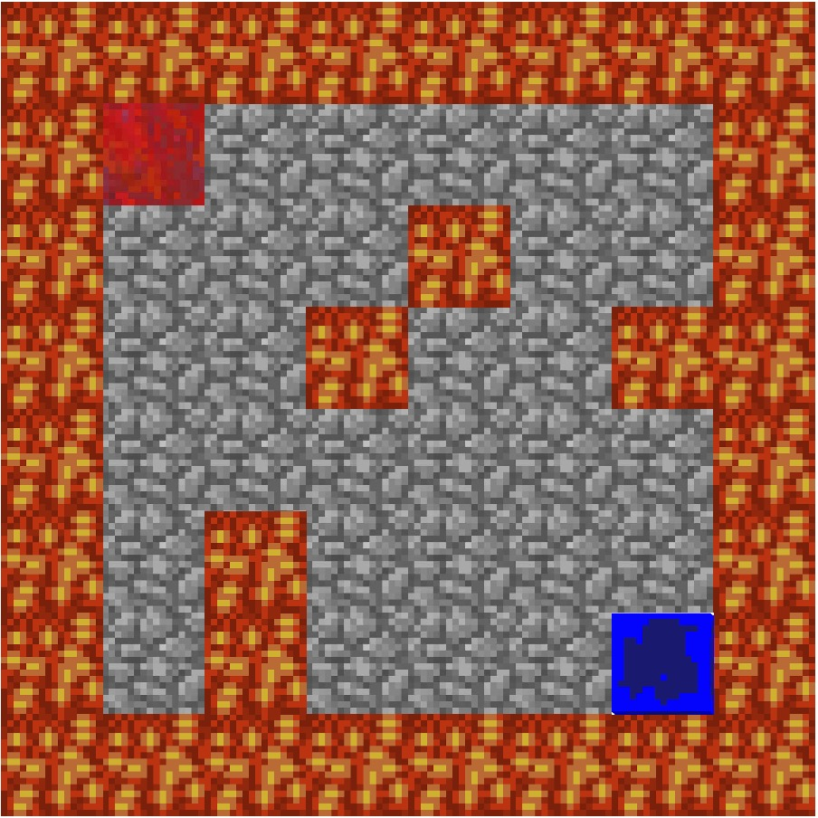
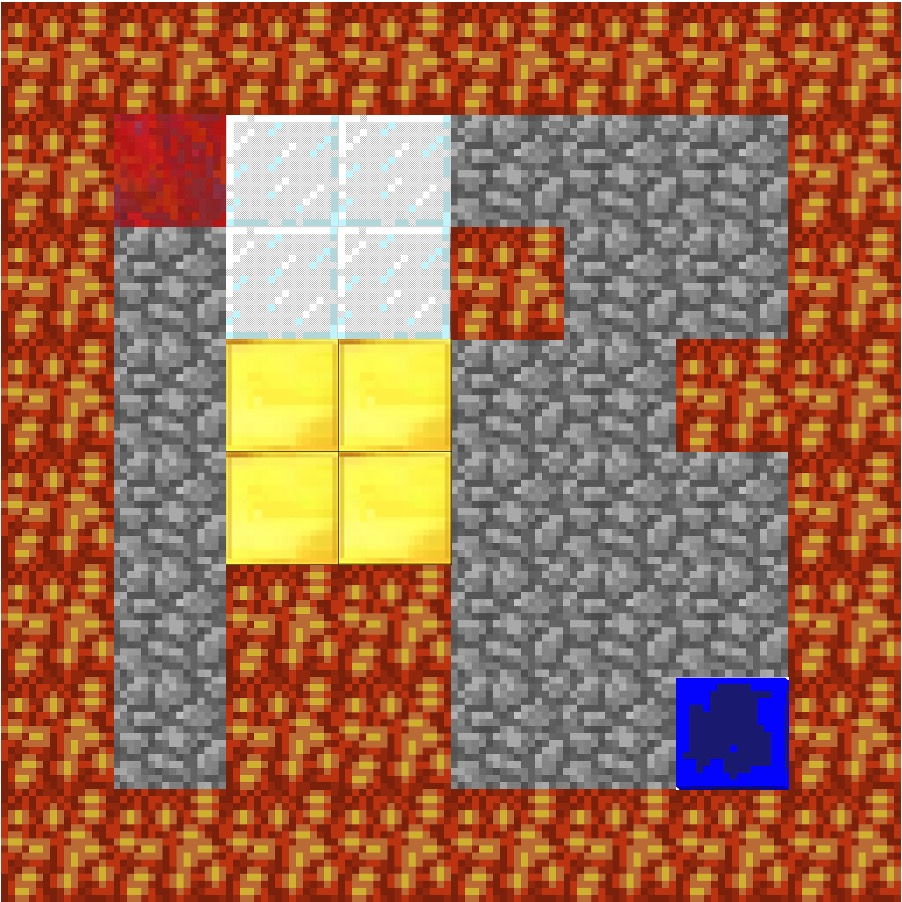

# Project Summary
&nbsp;&nbsp;&nbsp;&nbsp; Solve an intricate maze with traps, lava, etc. Optimize by trying to improve the time the agent solves the maze or by finding the most optimal path. The input of the project would require a section of the map the agent would traverse. Output would be the most optimal path discovered by the agent. Lastly, we assume that every block is unknown and the agent must discover each path. Direct applications of this project would allow users to optimally beat multiple video games. At a high level, reinforcement learning discovered from this project can determine the ideal behavior within the manufacturing, delivery, and finance industries.

Level 1: Flat terrain, with edge boundary  
Level 2: Flat terrain, with edge boundary and hazards in the middle of the map  
Level 3: 3D terrain, hills, hazards, blocks  
Level 4: 3D terrain, hills, hazards, blocks, and timed jumps  
Level 5: Moonshot case- 3D terrain, hills, hazards, blocks, timed jumps, and zombies  

  


# Approach

For progress report, our approach used the Q-Learning algorithm. Here is the equation of Q-Learning algorithm and our parameter set-up.
&nbsp;&nbsp;&nbsp;&nbsp; &nbsp;&nbsp;&nbsp;&nbsp; &nbsp;&nbsp;&nbsp;&nbsp; The Q-Learning equation: ![][1]
```python
self.epsilon = 0.01 # chance of taking a random action instead of the best
self.alpha = 0.1 # learning rate
self.gamma = 1.0 # discount rate
        
# Set of actions
self.actions = ["movewest 1", "moveeast 1", "movenorth 1", "movesouth 1", "jumpnorth 1", \
                        "jumpsouth 1", "jumpwest 1", "jumpeast 1"]
self.action_cost = [0, 0, 0, 0, 9, 9, 9, 9]
```
**Learning Rate**: Alpha represent the learning rate, it is value between 0 and 1 ( 0 < a < 1). It indicates how much the utility values will be updated every time the agent takes an action. alpha = 0 means the agent will not learn anything. alpha = 1 means the agent will not consider any feature states (the agent only consider most recent information). In stochastic environment, alpha is preferable closer to 0 than 1. In our approach, we decide alpha value to be 0.1.


# Evaluation


# Remaining Goals and Challenges

[1]:	https://github.com/Moe202/Reward-Finder/blob/master/docs/images/eq.gif